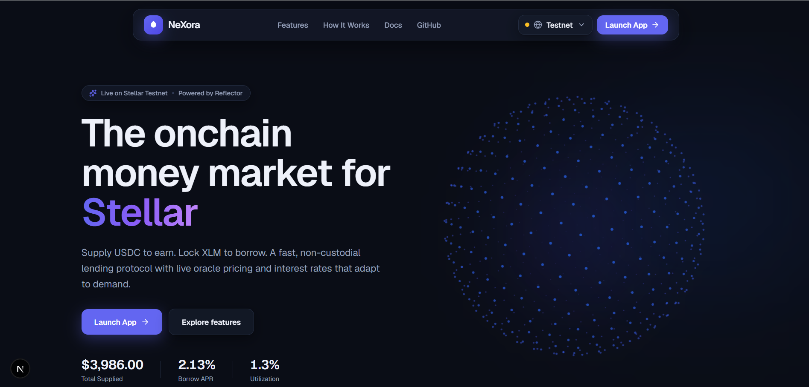
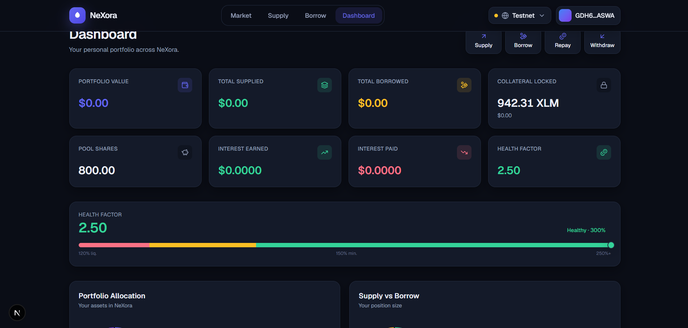
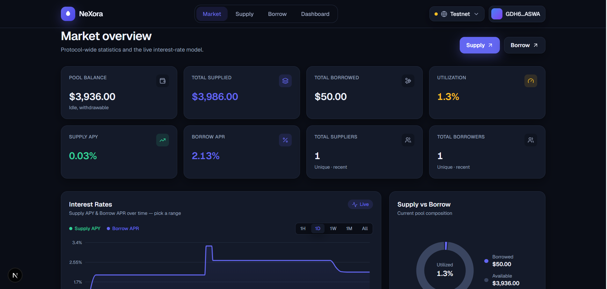
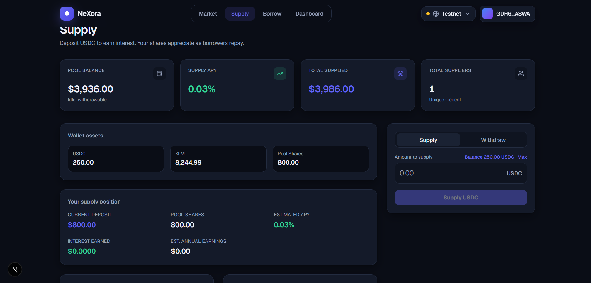
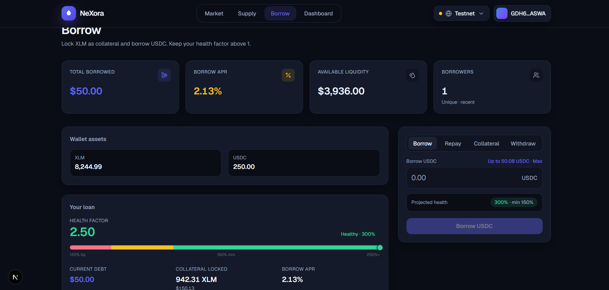
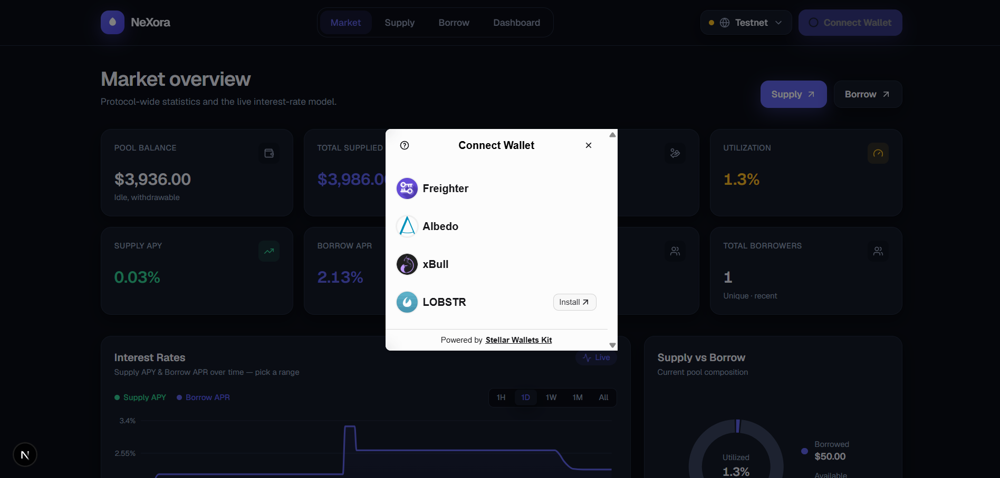
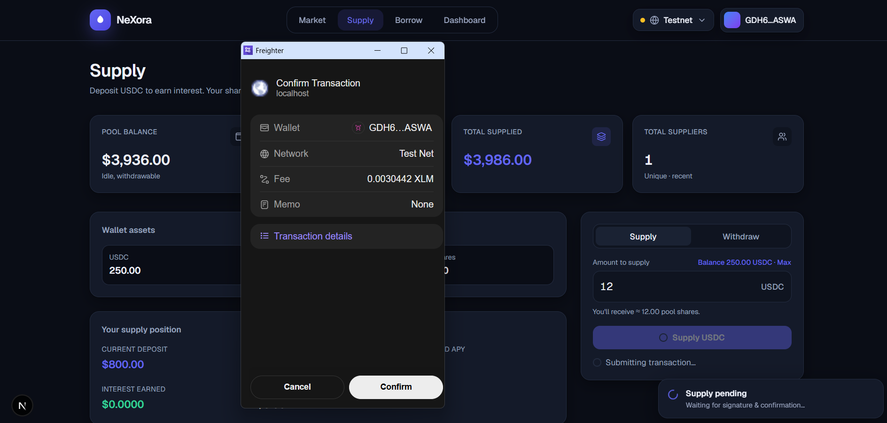
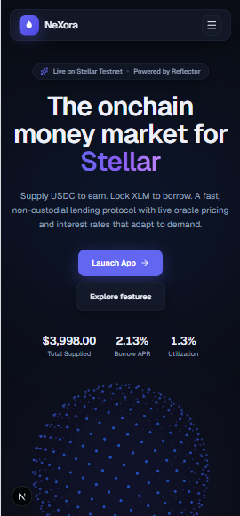

# NeXora

**NeXora** is an overcollateralized lending protocol built on **Stellar** with **Soroban** smart
contracts. Lenders supply **USDC** to earn passive yield; borrowers lock **XLM** as collateral to
borrow USDC against it. Interest rates adjust automatically with pool utilization, collateral is
priced in real time by the **Reflector** oracle, and undercollateralized positions can be
liquidated to keep the protocol solvent.

> Runs on **Stellar Testnet**. Non-custodial — you sign every action.

### What it does

- **Supply & earn** — deposit USDC into a shared pool and earn interest that compounds into your
  share value.
- **Borrow against XLM** — lock XLM collateral and draw USDC up to a 150% collateral ratio.
- **Dynamic interest rates** — a utilization curve moves borrow APR from 2% to 50%, balancing
  supply and demand.
- **Live oracle pricing** — collateral valued in real time by Reflector; risky actions fail safe if
  the feed is unavailable.
- **Liquidations** — anyone can repay an unhealthy loan (ratio < 120%) and seize collateral at a
  10% bonus.
- **Multi-wallet** — connect with **Freighter**, **xBull**, **Albedo**, or **Lobstr**.

---

## Demo Video : [youtube](https://youtu.be/2et_6l7q1q8?si=D9zTLazWmCWWabvS)
## Live Demo : [Vercel](https://nexora-tau-coral.vercel.app/)
## Feedback Sheet: [Google Sheet](https://docs.google.com/spreadsheets/d/1Lwca4hJAdGdkM0qnDDy-1FXYDsAZhOhMr_H1QmYMzFU/edit?usp=drivesdk)

## Live contract addresses (Testnet)

| Contract | Address | Explorer |
| --- | --- | --- |
| Lending Pool (Contract A) | `CDJ6PB7ZFG4JBEQCJAIQTKEIEYS3GAW2AYQEECDSNNLHSIP6PGUFB4TN` | [View Contract](https://stellar.expert/explorer/testnet/contract/CDJ6PB7ZFG4JBEQCJAIQTKEIEYS3GAW2AYQEECDSNNLHSIP6PGUFB4TN) |
| Collateral Manager (Contract B) | `CDN2NQXMAB72NQQV4N5NGYCT752IIGLENMUQ3QHQZ2YOZ7MCFUMG7LOQ` | [View Contract](https://stellar.expert/explorer/testnet/contract/CDN2NQXMAB72NQQV4N5NGYCT752IIGLENMUQ3QHQZ2YOZ7MCFUMG7LOQ) |
| USDC (test asset) | `CCC353VPTJ4DM75ZAFEIEBAPE2XTROQOV4M5XPJZAWRSDJRRQX7GH2O2` | [View Contract](https://stellar.expert/explorer/testnet/contract/CCC353VPTJ4DM75ZAFEIEBAPE2XTROQOV4M5XPJZAWRSDJRRQX7GH2O2) |
| XLM (native asset) | `CDLZFC3SYJYDZT7K67VZ75HPJVIEUVNIXF47ZG2FB2RMQQVU2HHGCYSC` | [View Contract](https://stellar.expert/explorer/testnet/contract/CDLZFC3SYJYDZT7K67VZ75HPJVIEUVNIXF47ZG2FB2RMQQVU2HHGCYSC) |
| Reflector oracle | `CCYOZJCOPG34LLQQ7N24YXBM7LL62R7ONMZ3G6WZAAYPB5OYKOMJRN63` | [View Contract](https://stellar.expert/explorer/testnet/contract/CCYOZJCOPG34LLQQ7N24YXBM7LL62R7ONMZ3G6WZAAYPB5OYKOMJRN63) |

Read the live pool state yourself:

```bash
stellar contract invoke \
  --id CDJ6PB7ZFG4JBEQCJAIQTKEIEYS3GAW2AYQEECDSNNLHSIP6PGUFB4TN \
  --source <your-identity> --network testnet --send=no -- get_pool_value
```

---

## Screenshots

### Landing page


### Dashboard


### Market overview


### Supply


### Borrow


### Multiple wallet support


### Signed-transaction confirmation (Freighter)


### Mobile responsive


---

## Tech stack

| Layer | Technology |
| --- | --- |
| Smart contracts | Rust · Soroban SDK 25 |
| Network | Stellar Testnet |
| Price oracle | Reflector (SEP-40) |
| Frontend | Next.js 16 · React 19 · TypeScript |
| Styling / motion | Tailwind CSS v4 · Framer Motion |
| Charts / icons | Recharts · lucide-react |
| Wallets | Stellar Wallets Kit (Freighter, xBull, Albedo, Lobstr) |
| Chain SDK | `@stellar/stellar-sdk` |

---

## Getting started

### Smart contracts

Requires the Rust toolchain and the [Stellar CLI](https://developers.stellar.org/docs/tools/cli).

```bash
# Run the unit-test suite (26 tests across both contracts)
cargo test

# Build both contracts to wasm
stellar contract build
```

### Frontend

```bash
cd frontend
npm install
npm run dev      # http://localhost:3000
```

Connect a testnet wallet, then use the in-app **Developer Tools** to get free test XLM (Friendbot)
and USDC (faucet) before supplying or borrowing.

---

## How it works

1. A lender **supplies USDC** and receives pool shares valued at `pool_value / total_shares`.
2. A borrower **locks XLM** and **borrows USDC** — the Collateral Manager checks the 150% ratio
   using the live Reflector price and asks the Pool to release funds.
3. Interest accrues on the loan based on utilization; when the borrower **repays**, principal and
   interest flow back to the pool, lifting every lender's share value.
4. If a price drop pushes a position below 120%, anyone can **liquidate** it — repaying part of the
   debt and claiming collateral at a discount.

### Architecture

NeXora is split into two smart contracts, mirroring the pool ↔ risk-engine separation used by
protocols like Aave and Compound. A bug in the risk logic can never directly corrupt core lender
fund accounting, and vice versa.

```
                 ┌───────────────────────┐        ┌──────────────────────────────┐
   USDC          │  Contract A — Pool     │        │ Contract B — Collateral Mgr  │
 ┌──────┐ supply │  • share accounting    │release │ • collateral (XLM) custody   │
 │Lender│───────▶│  • reserve / borrowed  │◀──funds│ • borrow / repay / health    │
 └──────┘◀───────│  • interest → shares   │ repay  │ • interest accrual           │   ┌──────────┐
        withdraw │                        │───────▶│ • liquidation                │──▶│ Reflector│
                 └───────────────────────┘        └──────────────────────────────┘   │  oracle  │
                        holds USDC                    holds XLM collateral            └──────────┘
```

### Key parameters

| Parameter | Value |
| --- | --- |
| Collateral / Borrow asset | XLM / USDC |
| Minimum collateral ratio | 150% |
| Liquidation threshold | 120% |
| Liquidation bonus | 10% |
| Interest curve | 2% base → 10% at 80% utilization → 50% at 100% (kink at 80%) |

---

## ✅ Level 4

### 4.1 User onboarding & wallet interaction proof

NeXora has been tested end-to-end with **12 independent Stellar testnet wallets**. Each wallet
authorized and submitted a real `deposit` transaction directly to the deployed Lending Pool —
every hash below is a live, on-chain transaction you can verify yourself on Stellar Expert.

| # | Wallet Address | Transaction Hash | Stellar Expert |
| --- | --- | --- | --- |
| 1 | `GADKGBFQMDOCCPHVRGKQBVV7ZPLNEJDW3RURPZJZTWMASETPPJMGZP7Q` | `572b25df128d51e27e5bb9099844aa5d6817d1ff22e6eaa0b8513084cfe59fbd` | [View Tx](https://stellar.expert/explorer/testnet/tx/572b25df128d51e27e5bb9099844aa5d6817d1ff22e6eaa0b8513084cfe59fbd) |
| 2 | `GDP745DOWM6BFZXYS5DIAUIJQKVLJGWOTKUNQUVH5IPGJXJZPRIOVZWI` | `4975cc7606c1e63362af2caf72ad0a4a08444a2d78631f51722713c98db75a6b` | [View Tx](https://stellar.expert/explorer/testnet/tx/4975cc7606c1e63362af2caf72ad0a4a08444a2d78631f51722713c98db75a6b) |
| 3 | `GCMIDSKI5OGSWRFESY54TBLBYMX4TEBPPKSWPMO6J4D6WZL3Z2UXZHE6` | `38c12cfcbecbc1aaa3c3e218a0842b8d7f510bc7ac8b13fb88aab35c5832b1c4` | [View Tx](https://stellar.expert/explorer/testnet/tx/38c12cfcbecbc1aaa3c3e218a0842b8d7f510bc7ac8b13fb88aab35c5832b1c4) |
| 4 | `GAP5IBHMGIP3UI7Z3BSIGIISDO4XAII2NXKH36ALDEKVR2HVASNHWSAW` | `cc238733296dfa0559a2ad4858ba48b295188201445231e1a4ef8c74505bfb40` | [View Tx](https://stellar.expert/explorer/testnet/tx/cc238733296dfa0559a2ad4858ba48b295188201445231e1a4ef8c74505bfb40) |
| 5 | `GAIKCYRM7T6LDFZR2PJ7YX3YTF67EJQVUSKBLEO7PKYTVWWLSHMKVXND` | `da89dd7101035ac89811ed9d939c2c4b286f3f77e1e6d2f0dc0bd5012ea6c9f9` | [View Tx](https://stellar.expert/explorer/testnet/tx/da89dd7101035ac89811ed9d939c2c4b286f3f77e1e6d2f0dc0bd5012ea6c9f9) |
| 6 | `GBC6JIEJORXTE522B7DXRZI36XVJQX544RGSVK7PFSPXFMIX56D6MW25` | `67e95f1ac6148bdbfb922fd80c7e26fd29fcde8c454a58a29c91dad5d271ba53` | [View Tx](https://stellar.expert/explorer/testnet/tx/67e95f1ac6148bdbfb922fd80c7e26fd29fcde8c454a58a29c91dad5d271ba53) |
| 7 | `GA6265FTQFOF2P3WIP5HGEJPU42EL26QFCMVDJGM5EDRF2A7K5AUOK4P` | `aed41891d100dfec2eadc30f49a9a2aa42fee003abbc33c04bef2f9bb531a183` | [View Tx](https://stellar.expert/explorer/testnet/tx/aed41891d100dfec2eadc30f49a9a2aa42fee003abbc33c04bef2f9bb531a183) |
| 8 | `GBYCZDHAHVJCL335SFBE2OA4IMKJ5VKU5EV2AAVY2VJIMBQLHALXVBZ6` | `e4afdf0c8f8986a54f23f4b3d17b90930e54fa1cd4f30bfc1fbe33a3f34a4c6d` | [View Tx](https://stellar.expert/explorer/testnet/tx/e4afdf0c8f8986a54f23f4b3d17b90930e54fa1cd4f30bfc1fbe33a3f34a4c6d) |
| 9 | `GCS5N4FZNI5MQ2DNOOCUOTRPK443JN7B35A6VWHF6SHMGNNAHFXMQ2TQ` | `fd11a5287bbf3cf02b2983a9881fe30f1b323862e6df3d44ffdb7591ee5f622f` | [View Tx](https://stellar.expert/explorer/testnet/tx/fd11a5287bbf3cf02b2983a9881fe30f1b323862e6df3d44ffdb7591ee5f622f) |
| 10 | `GCZUWXCUUDHONO45I5G6BJLEMJTYZPDLKTAQSDDTUN74MJWLWSDLLHK3` | `e413caca6cda585f9ccacadddae1f8bf3672fc777b9a3ab5abfe86f1719a5442` | [View Tx](https://stellar.expert/explorer/testnet/tx/e413caca6cda585f9ccacadddae1f8bf3672fc777b9a3ab5abfe86f1719a5442) |
| 11 | `GBXIRXX73WLROPADPAHGT623I3ATFWWTKGRVL4WNL327EPMIGS7XD4QC` | `a68e7b1ed12a9480128e4083d44598ed8d898a8dd9823334fc363b7e877fe0c9` | [View Tx](https://stellar.expert/explorer/testnet/tx/a68e7b1ed12a9480128e4083d44598ed8d898a8dd9823334fc363b7e877fe0c9) |
| 12 | `GDVUNU673PEIMTGENDFCCOIY3QPRFNCWXHCWTYILAQG5A63CJUNNVBVL` | `00184800fffe94ba196b6acaae9c7defa050796be047bd5e6f9717418ca29ff6` | [View Tx](https://stellar.expert/explorer/testnet/tx/00184800fffe94ba196b6acaae9c7defa050796be047bd5e6f9717418ca29ff6) |

```bash
stellar contract invoke \
  --id CDJ6PB7ZFG4JBEQCJAIQTKEIEYS3GAW2AYQEECDSNNLHSIP6PGUFB4TN \
  --source <your-identity> --network testnet --send=no -- get_total_deposited
```

### 4.2 User feedback collected

Twelve testers used NeXora end to end — connecting a wallet, supplying USDC, borrowing against
XLM, and watching their dashboard update. Their feedback surfaced **10 concrete problems** and **2
positive confirmations**; every problem was reproduced against the live app before being fixed.

### 4.3 Improvements based on user feedback

| User # | Name | Gmail | Wallet Address | Feedback | Fix / Solution |
| --- | --- | --- | --- | --- | --- |
| 1 | Avijit Roy | royavijit34@gmail.com | `GADKGBFQMDOCCPHVRGKQBVV7ZPLNEJDW3RURPZJZTWMASETPPJMGZP7Q` | Clicked Connect Wallet without a wallet extension installed — the button just stopped spinning and went back to normal, no message, nothing. I didn't know if it was still trying, if I did something wrong, or if the app was just broken. | Any connect failure other than closing the modal was silently swallowed. Added an error message next to the Connect Wallet button so a real failure (missing extension, kit/network error) says so instead of just going quiet. |
| 2 | Deb Seal | devseal22@gmail.com | `GDP745DOWM6BFZXYS5DIAUIJQKVLJGWOTKUNQUVH5IPGJXJZPRIOVZWI` | My wallet popup took a while to respond once, and the **"Waiting for signature…"** toast just sat there afterward with no way to close it — I had to refresh the page. | Toasts for a pending transaction never auto-dismiss (correct — it might still land), but they also had no close button at all. Added a manual dismiss to every toast, pending included. |
| 3 | Satakshi Patra | satakshipatra2108@gmail.com | `GCMIDSKI5OGSWRFESY54TBLBYMX4TEBPPKSWPMO6J4D6WZL3Z2UXZHE6` | I left a loan open for a while, then came back — the "Owed" amount and my Max-repay figure on the Borrow form hadn't grown at all since I opened it, even though interest should be accruing the whole time. | The Borrow page's own read-only stats already accrued interest live for display, but the form that actually submits transactions was still reading the contract's last-*stored* (non-live) interest — so its Max/health/required-collateral figures could look safer than what the transaction would actually see. Wired it to the same live-accrual math. |
| 4 | Sourav Das | dassourav29@gmail.com | `GAP5IBHMGIP3UI7Z3BSIGIISDO4XAII2NXKH36ALDEKVR2HVASNHWSAW` | Once I connected, the little wallet-address chip in the top corner was a totally different blue/purple than the rest of the app's indigo theme — looked like a leftover placeholder. | The chip's gradient was never updated to match the brand palette. Changed it to the same indigo used by the logo and every other accent. |
| 5 | Puja Dey | deypuja82@gmail.com | `GAIKCYRM7T6LDFZR2PJ7YX3YTF67EJQVUSKBLEO7PKYTVWWLSHMKVXND` | My balance read failed for a second on a spotty connection — the app told me it couldn't read my balances, but right underneath that it *also* said "You only have 0.00 USDC," which flatly contradicted the warning above it, and blocked me from doing anything until I reloaded the whole page. | A failed balance read defaulted to a literal $0.00 and was shown as fact right alongside the "may be out of date" warning. The insufficient-funds message is now suppressed while the balance is stale, and a Retry button sits right next to the warning instead of requiring a full reload. |
| 6 | Arijit Ghosh | ghosharijit38@gmail.com | `GBC6JIEJORXTE522B7DXRZI36XVJQX544RGSVK7PFSPXFMIX56D6MW25` | Clicked **Add USDC Trustline** in Developer Tools and nothing seemed to happen, so I clicked it again and got a second wallet popup for the same thing. | That button never showed a loading state, unlike the faucet buttons right next to it. Wired it to the same pending/disabled state so a second click can't fire while the first is still signing. |
| 7 | Pulak Dey | deypulak987@gmail.com | `GA6265FTQFOF2P3WIP5HGEJPU42EL26QFCMVDJGM5EDRF2A7K5AUOK4P` | I clicked **Repay** from the Dashboard's quick actions and it took me to the Borrow page — but landed on the Borrow tab, not Repay, so I had to notice that myself and click Repay. Same thing with **Withdraw** landing on Supply instead of Withdraw. | The quick-action links routed to the right page but carried no signal for which tab to open, and both forms always defaulted to their first tab. They now read a `?tab=` query param on load so Repay and Withdraw pre-select the right one. |
| 8 | Rani Sarkar | ranisarkar390@gmail.com | `GBYCZDHAHVJCL335SFBE2OA4IMKJ5VKU5EV2AAVY2VJIMBQLHALXVBZ6` | I tested on my laptop and my phone with the same wallet — my "Interest Earned" showed real numbers on one and a confident **$0.0000** on the other, with nothing telling me why. | That figure is tracked client-side per browser and used to show a confident zero even when it simply had no local history for that device. Added a "Tracked on this device" label, and swapped the confident $0.0000 for a plain "—" whenever real pool shares exist but no local cost-basis data does. |
| 9 | Bubai Roy | roybubai23@gmail.com | `GCS5N4FZNI5MQ2DNOOCUOTRPK443JN7B35A6VWHF6SHMGNNAHFXMQ2TQ` | The XLM price shown is live — I watched my collateral value move while the page was open. | No fix needed — kept the Reflector oracle read, which fails safe rather than using a stale price. |
| 10 | Tanisha Dey | tanishadey10@gmail.com | `GCZUWXCUUDHONO45I5G6BJLEMJTYZPDLKTAQSDDTUN74MJWLWSDLLHK3` | I fat-fingered an extra decimal point typing an amount on my phone (`12.5.0`) and the Supply button just stayed greyed out — no idea why. | The input let a second `.` through, which silently parsed to zero downstream with no error shown. Now the field itself collapses extra dots instead of producing a value that quietly fails. |
| 11 | Arup Majumdar | majumdararup23@gmail.com | `GBXIRXX73WLROPADPAHGT623I3ATFWWTKGRVL4WNL327EPMIGS7XD4QC` | After fully repaying my loan I still had collateral locked, so I went back to the Repay tab out of habit and hit Max — it filled in some tiny nonzero amount even though I owed nothing, and the button let me submit anyway. It just reverted. | Max always computed a small nonzero target even at zero debt, and nothing blocked submit either — the transaction failed on-chain with "no debt to repay" instead of pointing me anywhere useful. That state now shows a plain "nothing owed" message with a direct link to Withdraw Collateral, and the button disables. |
| 12 | Koyel Ray | raykoyel11@gmail.com | `GDVUNU673PEIMTGENDFCCOIY3QPRFNCWXHCWTYILAQG5A63CJUNNVBVL` | Switching between Freighter and Albedo mid-session to compare them was seamless — no leftover state from the previous wallet, no confusing overlap. | No fix needed — wallet switching correctly resets address/session state on each new connection. |

### 4.4 Complete fix log

A separate, earlier testing pass surfaced **12 additional issues**, since fixed. The full list,
with the files each change landed in, is below. All 26 contract tests, `tsc --noEmit` and
`next build` pass after these changes.

| # | Issue found | Fix implemented | Files changed |
| --- | --- | --- | --- |
| 1 | Wrong error message for a liquidity shortfall | Errors now carry the contract that raised them; each contract has its own message table. | `lib/soroban.ts`, `lib/useTx.ts` |
| 2 | Unconfirmed transaction reported as failed | An unconfirmed transaction is *indeterminate*, not failed. Window raised 30s → 90s, plus a distinct `unconfirmed` state that surfaces the hash with a “track transaction” link. | `lib/soroban.ts`, `lib/useTx.ts`, `components/TxFeedback.tsx` |
| 3 | Dashboard numbers frozen after load | 15-second background poll plus refresh on window focus. | `lib/data.tsx` |
| 4 | Health factor flattering an old loan | Switched from `check_health` to `check_health_live`. | `lib/contracts.ts` |
| 5 | Withdraw “Max” always reverts | Max capped at available liquidity; submit disabled past it. | `components/supply/SupplyForm.tsx` |
| 6 | Borrow “Max” ignores pool liquidity | Borrowable is `min(collateral headroom, available liquidity)`. | `components/borrow/BorrowActions.tsx` |
| 7 | False “You have no USDC yet” | RPC read failures were flattened to a zero balance; now distinguished via `Balances.stale`. | `lib/contracts.ts`, `components/supply/SupplyForm.tsx` |
| 8 | 150% displayed for a rejected position | `bpsToPct` truncates instead of rounding. | `lib/format.ts` |
| 9 | Full repayment leaves dust | Interest accrues before the ledger applies the tx; Max now overshoots slightly and `repay` clamps to what is owed. | `components/borrow/BorrowActions.tsx` |
| 10 | Faucet returns an opaque 502 | The trustline probe treated every non-`#13` error as “trustline present”; unrecognised failures now raise. | `app/api/faucet/route.ts` |
| 11 | Amount conversion contradicts its comment | `toStroops` multiplied a double by `1e7` despite claiming string-space maths; rewritten to parse the decimal. | `lib/format.ts` |
| 12 | Auto-refresh would hammer the RPC | Participant counts decoupled from the poll tick onto an explicit-refresh-only path. | `lib/data.tsx` |

---

## 🏆 Level 5: 50+ On-Chain User Interactions

Each of the **52 wallets** below is a separate Stellar testnet keypair that authorized and
submitted its own `deposit` call to contract `CDJ6PB7ZFG4JBEQCJAIQTKEIEYS3GAW2AYQEECDSNNLHSIP6PGUFB4TN`.

| Metric | Value |
| --- | --- |
| Unique wallets that interacted | **52** |
| Total supplied to the pool | **13,254 USDC** |
| Wallets that also opened a loan | **16** |
| Total borrowed against XLM collateral | **807 USDC** |

| # | Wallet Address | Transaction Hash | Stellar Expert |
| --- | --- | --- | --- |
| 1 | `GC75IMZ5QDGJH6NPV7EJFXPJJB7EDJ5FZ22PPVCIGNMLC4ZU6APCONGN` | `4e02a3f1d4a9c330a44063e25f719e24ca1b09772fd99098f23cce8b24ed394a` | [View Tx](https://stellar.expert/explorer/testnet/tx/4e02a3f1d4a9c330a44063e25f719e24ca1b09772fd99098f23cce8b24ed394a) |
| 2 | `GDNITOZYX3VVZJXYJABN7BZCU54SEYV5L6UJUPV2KIYNAYYQKU7BJSW5` | `21e3dd9d2da5e018ba80fba951e4eed521b394f91dc7ade441318a157f27e9a6` | [View Tx](https://stellar.expert/explorer/testnet/tx/21e3dd9d2da5e018ba80fba951e4eed521b394f91dc7ade441318a157f27e9a6) |
| 3 | `GC5P3DRGBARHK52DWYHK6B2OQHNS3TSFL5MXRDJTSRIPWDP2CKWB5LXS` | `5d19146ba5f46f618019e2f4947aa2ced65266e585f95e7d05aeaf96b92bf28e` | [View Tx](https://stellar.expert/explorer/testnet/tx/5d19146ba5f46f618019e2f4947aa2ced65266e585f95e7d05aeaf96b92bf28e) |
| 4 | `GDUNI2NRPI77WL6FOCOTV5MXKE4EJENO5JZZJZONCNBLE4BYPKMTI2IY` | `80a122e9601da46c3f13068fe399e0a4bf772d2bdcc4e3724657bb8e6bb8a65d` | [View Tx](https://stellar.expert/explorer/testnet/tx/80a122e9601da46c3f13068fe399e0a4bf772d2bdcc4e3724657bb8e6bb8a65d) |
| 5 | `GDSR4P3H235OE7VNLPQQIZ4KIFP7BHTHMZ6HOFH5EJE67P46GQJAUYI5` | `9cf5413e7aad2d88c0678cacca8eb253953cc1f987bb5fcdee1763b1d99601b1` | [View Tx](https://stellar.expert/explorer/testnet/tx/9cf5413e7aad2d88c0678cacca8eb253953cc1f987bb5fcdee1763b1d99601b1) |
| 6 | `GD7KKWNOC55F3MF6JS4ADQ3U5D4STG4B2PPY5O57LRQC6D7BIVR6O3FA` | `5a85a53c799ede85d90087abe3f43d2795b47197e854cf9879a02d7d00e9e06c` | [View Tx](https://stellar.expert/explorer/testnet/tx/5a85a53c799ede85d90087abe3f43d2795b47197e854cf9879a02d7d00e9e06c) |
| 7 | `GA2SLRGKYUSEEQD2VZQ6Y5ZMJKEWMUIVLMG6OJPDVOT6QH5KM2XXOX2A` | `c4c3855a42168d95c2177bbfaea6005b702759b340ec841d0570f98a65895719` | [View Tx](https://stellar.expert/explorer/testnet/tx/c4c3855a42168d95c2177bbfaea6005b702759b340ec841d0570f98a65895719) |
| 8 | `GDL7XAD72JMTGA65X55QRSLNE4A2L7F2WAWAMWXFF5N6WSXLNUG6XO53` | `a5ef158b98cf02d9eb0f5144ca8794f56597bc1c50e7d32791e1c0bc91868a8a` | [View Tx](https://stellar.expert/explorer/testnet/tx/a5ef158b98cf02d9eb0f5144ca8794f56597bc1c50e7d32791e1c0bc91868a8a) |
| 9 | `GDD2IMHRCGKTUWG3EO5CH32ZL5NPF6QXUB62KZMYN65Z6ZMNPCNT6SHP` | `a651f3adc59ccd53bcbae42b4e0a26923664f74b078fc01fe2aec2bf3b6604da` | [View Tx](https://stellar.expert/explorer/testnet/tx/a651f3adc59ccd53bcbae42b4e0a26923664f74b078fc01fe2aec2bf3b6604da) |
| 10 | `GBF5QTSLL3TKAG27WUWKJEEVK6XJUO4UL75CNQCBB6XKHBQCZN5APSRQ` | `05f8cbc9a6cb4525f9af4740116c5e25855ab11a1893842d70b0500fbc2ce8a9` | [View Tx](https://stellar.expert/explorer/testnet/tx/05f8cbc9a6cb4525f9af4740116c5e25855ab11a1893842d70b0500fbc2ce8a9) |
| 11 | `GBPJDIQ4BZTKEIALUQBBJD5A5DBFUQCEPWR34BIPYTMAXMZLKDMG566Y` | `f76017f145758a52458b4614aeb2d76d567db4254f6896ef0894de5daf57cf99` | [View Tx](https://stellar.expert/explorer/testnet/tx/f76017f145758a52458b4614aeb2d76d567db4254f6896ef0894de5daf57cf99) |
| 12 | `GBJ6SDQAEUUS3XHDG7RCP2RDRQCV5EXAMV3BJ2GASPV5ANU4J272EZAK` | `8c1cb5c5d7d9f3b17b3d41e3aa358b99f6b88a402975343016bdb3a0eabf0e47` | [View Tx](https://stellar.expert/explorer/testnet/tx/8c1cb5c5d7d9f3b17b3d41e3aa358b99f6b88a402975343016bdb3a0eabf0e47) |
| 13 | `GBBZJC2BAHRS23MLGKIIDMN5YJA6TL4O442NW2ZKYFLY24G6BR3RODUF` | `055e42b1c9a7c0f205854b6c77d67bdcb97d64a254621c8c7e103807580f17d1` | [View Tx](https://stellar.expert/explorer/testnet/tx/055e42b1c9a7c0f205854b6c77d67bdcb97d64a254621c8c7e103807580f17d1) |
| 14 | `GB2MISFI5L4NQV3NYKNPDZGVVTPIMXGUXKSRCO3UZFLVXSASBWDGVBPN` | `837a0ddc17672540280747d689b7fe309abaebf870047ac90aac1dcaa5cc1439` | [View Tx](https://stellar.expert/explorer/testnet/tx/837a0ddc17672540280747d689b7fe309abaebf870047ac90aac1dcaa5cc1439) |
| 15 | `GBD3GKMMRQWBS222WQT4BYXLWPNKJQQWHI5QCHZ63NB4RPIP6RJF7EVL` | `7b3355b377f10dba4667d071ff2d5279ced33da8aaa83e63437b574f67a31030` | [View Tx](https://stellar.expert/explorer/testnet/tx/7b3355b377f10dba4667d071ff2d5279ced33da8aaa83e63437b574f67a31030) |
| 16 | `GASBY2RY6PP6GVKW5CS5D5K3JRHAR5HJT4BHBOR53P5IBZBL7NSIJVDG` | `aac17ba21997c67fb621723489da03e7d7c658a28ddc2716f816de1a1b218424` | [View Tx](https://stellar.expert/explorer/testnet/tx/aac17ba21997c67fb621723489da03e7d7c658a28ddc2716f816de1a1b218424) |
| 17 | `GBCND3MEISZ5QSU36SA6LKKPI4UCLVYCJX5WY4GJ6DALC4H3D5J2ZLDB` | `6b5668d3e3bb7dd67beada3ba56eb13d9fcdbe549f35c13a26c233b8af0ac3ee` | [View Tx](https://stellar.expert/explorer/testnet/tx/6b5668d3e3bb7dd67beada3ba56eb13d9fcdbe549f35c13a26c233b8af0ac3ee) |
| 18 | `GCHOSY5QFPRHVWGUYM4WKM6MCN5EVJZ3DBXTBCHNNASWVX6X2LUROYV4` | `e8042a7cf272cfea40253c9cd68608ca42ffaa2e0ff9c1e983b1197d81f7e47f` | [View Tx](https://stellar.expert/explorer/testnet/tx/e8042a7cf272cfea40253c9cd68608ca42ffaa2e0ff9c1e983b1197d81f7e47f) |
| 19 | `GCUYRGC3YZJL2A5BPNTXC54QAV2R56FUV3YGGVFOQTAYQQEIETD3YSZV` | `dc22445719a88e6e6cb355341d7e1a9231b526a5b5a8f16cc1eb3e4ae8df5795` | [View Tx](https://stellar.expert/explorer/testnet/tx/dc22445719a88e6e6cb355341d7e1a9231b526a5b5a8f16cc1eb3e4ae8df5795) |
| 20 | `GCDG5P6XOBAFLBBHSFMUWZ4EXEPAWZGA25CC7HBLUUOILB33EJRC6C3P` | `40537ff87b4d145f7e71c1535ad96bd2a6150869052cfee1549558eab279620d` | [View Tx](https://stellar.expert/explorer/testnet/tx/40537ff87b4d145f7e71c1535ad96bd2a6150869052cfee1549558eab279620d) |
| 21 | `GAZBP7K77A5DE5WCH7LDSJXK7CQF5NG2IZSFAS2RAVY7QRSXMLUYL6M3` | `8b785bc21baedb08fa7a8a6fa2c3cc2f42298795c88b8c5377f9aef670f49d21` | [View Tx](https://stellar.expert/explorer/testnet/tx/8b785bc21baedb08fa7a8a6fa2c3cc2f42298795c88b8c5377f9aef670f49d21) |
| 22 | `GCPCGDYWPGHG7OV3ZJ26DZQE5JFN53JZ6LTECXY72QKBMFZ7CPMJAMTA` | `9b318deb8e291a0c999584e7d5c2efcfe7ca6ba8e30eff348e2d788512727970` | [View Tx](https://stellar.expert/explorer/testnet/tx/9b318deb8e291a0c999584e7d5c2efcfe7ca6ba8e30eff348e2d788512727970) |
| 23 | `GB6LKKH5RSUEEI45QMQ6RCHZ6SW4H3IH2O5E5A3GJE6PCLBORCI4VJH6` | `261daa2934b202654469a403873a88de98a6b082b6c5253d622f3ce622a48e0c` | [View Tx](https://stellar.expert/explorer/testnet/tx/261daa2934b202654469a403873a88de98a6b082b6c5253d622f3ce622a48e0c) |
| 24 | `GA4BHGQCDUEGNCA2RPWAB73QQHBLHI66QBS5WIZ4VCBRIWKBMHWGOK5A` | `b6d824ecb3db81da23da1f4b282510c8f64341839498c4985276cbd6282f3ae7` | [View Tx](https://stellar.expert/explorer/testnet/tx/b6d824ecb3db81da23da1f4b282510c8f64341839498c4985276cbd6282f3ae7) |
| 25 | `GBWED7JJ7USSO2PYTXWADOGQXO6VBXYDTRJQWWKLWDIY755WBY7Z2MR7` | `9eff6392eac90bff35e8ae6e090de2f4296ce772f6141de3496082a04035172d` | [View Tx](https://stellar.expert/explorer/testnet/tx/9eff6392eac90bff35e8ae6e090de2f4296ce772f6141de3496082a04035172d) |
| 26 | `GATGZWUOHTUBP2KKDIGYQK5FLWWGB55O7JKHURU5PQIZDYVXIULIT735` | `0112fab133b0ceae00d51409c7b27ca1e9edd6a15a2fef6e8856f00c45ed6b58` | [View Tx](https://stellar.expert/explorer/testnet/tx/0112fab133b0ceae00d51409c7b27ca1e9edd6a15a2fef6e8856f00c45ed6b58) |
| 27 | `GA747ENWAKC7JRXIYBQZKW3TUGBA64W7R3YFAG7VFYJKPEXT6DPRCVIH` | `a146df9cdc6a7cbf2b34f78680f3e61951f6027cb9bd828fed35f47f5325e210` | [View Tx](https://stellar.expert/explorer/testnet/tx/a146df9cdc6a7cbf2b34f78680f3e61951f6027cb9bd828fed35f47f5325e210) |
| 28 | `GA4DXRSASF7RWMDRRVTWZGLW7VXPLAP3QP2JXJMI3AMFFROJCEGIHH4G` | `22e718842dc9c113e86d91d5416bfcf8c10c838f3e4e2c6188144eecc66b5b11` | [View Tx](https://stellar.expert/explorer/testnet/tx/22e718842dc9c113e86d91d5416bfcf8c10c838f3e4e2c6188144eecc66b5b11) |
| 29 | `GD5DP3R6A7YFQSB4IOMOIPGGT2BSQRUNRTKKIBTM6CJ4UIMJ4TWXMBB4` | `ae85b70365fee0a84e91d1cb845581853e1d3616980cbab9aac2c326293e089f` | [View Tx](https://stellar.expert/explorer/testnet/tx/ae85b70365fee0a84e91d1cb845581853e1d3616980cbab9aac2c326293e089f) |
| 30 | `GDE3DOULZBJ4PBUQAYQS44XTL72JQNYKS3HTKDAPGDW3W7U7SADPWH4S` | `874b36b6691f5e0d25a23c81e54f6581f71c76750ff9964f88dbf204b19649ba` | [View Tx](https://stellar.expert/explorer/testnet/tx/874b36b6691f5e0d25a23c81e54f6581f71c76750ff9964f88dbf204b19649ba) |
| 31 | `GDVSBJJYZWBJIC3FF2ORUCHXG5MU42CXJBJ6CVGP6EWNTP7MPM6RYCVX` | `f1ab51d3c060ee46eb90f9e0930ab8cd6048268fe8a9c4238d1c07ede4687f21` | [View Tx](https://stellar.expert/explorer/testnet/tx/f1ab51d3c060ee46eb90f9e0930ab8cd6048268fe8a9c4238d1c07ede4687f21) |
| 32 | `GC7ACRJYOH76IBTIIBQM4VKGEOUWZQYIIRIE4N4A47FWEE6I7RJQ2YSG` | `c2a48003a445e54e5be72bf55447590c00113a11e9ae607af8843f57679fb256` | [View Tx](https://stellar.expert/explorer/testnet/tx/c2a48003a445e54e5be72bf55447590c00113a11e9ae607af8843f57679fb256) |
| 33 | `GBE5Q5PZMQNUWDYALE4HA5KVLYVR4AJGTQFCTBJEB3ZLCJBRO3ENWFLW` | `5308272b95a328f208101bd50525563996661f4bbc74a8179d113faee4d8c959` | [View Tx](https://stellar.expert/explorer/testnet/tx/5308272b95a328f208101bd50525563996661f4bbc74a8179d113faee4d8c959) |
| 34 | `GD4ZBDK2LQGDI376JWT2AY7EVTCLI5MH3ZZCZ46GD5UIWFCSXI7WCZZH` | `e33dde0e1091e6178909b276726bec03105ead4a4a8f0976e062bd476c6e761c` | [View Tx](https://stellar.expert/explorer/testnet/tx/e33dde0e1091e6178909b276726bec03105ead4a4a8f0976e062bd476c6e761c) |
| 35 | `GD4AWDYNYJHDPBSHXRU37I3XLJA7KCRYUE5S7JJKPAYYOJFLXL5WARUO` | `0f948f9dd1ad4161f075a0d76e5cce879982d36eb84c6dd4bb3f1016ee38ddc1` | [View Tx](https://stellar.expert/explorer/testnet/tx/0f948f9dd1ad4161f075a0d76e5cce879982d36eb84c6dd4bb3f1016ee38ddc1) |
| 36 | `GC2OH3RCO23NA72SQ4S7XNL3PTBAAO5JAQSX5XYXPGGPNVYKZNLM4J5B` | `61c77a540f4acb4f6c6db0853ebf2099066ba934b86c4bed4d5c38a1a47b9252` | [View Tx](https://stellar.expert/explorer/testnet/tx/61c77a540f4acb4f6c6db0853ebf2099066ba934b86c4bed4d5c38a1a47b9252) |
| 37 | `GCGEHWGWS7V72PV2UFLE6MDHNEFLOSHQOK2Q2PZJZFSRRANCS5FBDYHK` | `a3619be80db7c9d306fc144b78c8406c187d75cf3a64251077663ff65e38fe24` | [View Tx](https://stellar.expert/explorer/testnet/tx/a3619be80db7c9d306fc144b78c8406c187d75cf3a64251077663ff65e38fe24) |
| 38 | `GCEV34DYJ2KWWGONXKFXGLPZSJ2UTV6URIH4HO4SX2T57DC4625HCI7Y` | `143a093d0c78a12b9a4927a976f75ab25d9343c147eeb13ab99883afa89d4ef9` | [View Tx](https://stellar.expert/explorer/testnet/tx/143a093d0c78a12b9a4927a976f75ab25d9343c147eeb13ab99883afa89d4ef9) |
| 39 | `GBL5C4FTQDDOLY6K5F7WVXQGLMHRANQC3ZJTGEDXXTKRDPDNIB6EJXTA` | `6823d99f8a099a06882882ba68740e37abeb64bf9175a924d264ac8c18c7b9df` | [View Tx](https://stellar.expert/explorer/testnet/tx/6823d99f8a099a06882882ba68740e37abeb64bf9175a924d264ac8c18c7b9df) |
| 40 | `GCT7RPIXLW267ZF7DHX62UGB5PO2NZBOSGBKSLXZCTJG4CXBETDMUZXS` | `099daa86169243afe5fbbd818b18f39c11f52df6608cdab89bffa524b6f535b2` | [View Tx](https://stellar.expert/explorer/testnet/tx/099daa86169243afe5fbbd818b18f39c11f52df6608cdab89bffa524b6f535b2) |
| 41 | `GDFPLFYBV65LWOBUBQOZLIZCO2P54EKJ3VBGRZWMX32R3H6NMDHFHCLF` | `a4453e1b7b37579da17bef2b17f6aab8baf7a3d94d0b0002c4ab91a7909bd501` | [View Tx](https://stellar.expert/explorer/testnet/tx/a4453e1b7b37579da17bef2b17f6aab8baf7a3d94d0b0002c4ab91a7909bd501) |
| 42 | `GCRUETHN7RB6Y7OHT476HEA6CNTZ5MGFVMNSWHLKMT4ZOWMUFH7TFEWU` | `5c5dd911f0cb1f7639e12727d4f18670413863f8d810eaebe910967021e53d55` | [View Tx](https://stellar.expert/explorer/testnet/tx/5c5dd911f0cb1f7639e12727d4f18670413863f8d810eaebe910967021e53d55) |
| 43 | `GAUKEZPLHKYZGP5BSAIM3S7K23RPCDG3ADVCUTXVMSPFPAHS5NEN3VYE` | `a3160a9c556a317c8a49b8f2a34358d5e18bdfe0cfc2cf88288b0ed2543a2517` | [View Tx](https://stellar.expert/explorer/testnet/tx/a3160a9c556a317c8a49b8f2a34358d5e18bdfe0cfc2cf88288b0ed2543a2517) |
| 44 | `GC7Y5FO6YXITPY2K7Z3PMAQAROER3JM3DTEEXMFGQHIRIP33IMUJDWSJ` | `c3cc6f315a8ab0d080d024a8943bf67c42a829858341bfd77185e1fde29ef61c` | [View Tx](https://stellar.expert/explorer/testnet/tx/c3cc6f315a8ab0d080d024a8943bf67c42a829858341bfd77185e1fde29ef61c) |
| 45 | `GDWTXZSR7JX5AOBRNVLJEWKKELMV7JWWMBEXNIMXZZ4QTVUQ3YU47K77` | `06c56e43415c50a073c5289abc657ac503648dd165cbd53230c1b57f07bb9892` | [View Tx](https://stellar.expert/explorer/testnet/tx/06c56e43415c50a073c5289abc657ac503648dd165cbd53230c1b57f07bb9892) |
| 46 | `GDFB4IA5WBNR7QLLA6MT3N36LYBUQQVWYOOD642E6FS34S3JPPZNWKO5` | `ce2674dff1849b1d2201118763b27f6ee06e58a841b05e4851f201d4a4b893d4` | [View Tx](https://stellar.expert/explorer/testnet/tx/ce2674dff1849b1d2201118763b27f6ee06e58a841b05e4851f201d4a4b893d4) |
| 47 | `GAIEKGCJ3ER3EWROTU7XUYRFHTNLHVMFB72NWM33TFMYIOYTDJTK4F4L` | `8e2c9a105a5ab1902e23b6794dad73a284600635070712812f6a54def149038f` | [View Tx](https://stellar.expert/explorer/testnet/tx/8e2c9a105a5ab1902e23b6794dad73a284600635070712812f6a54def149038f) |
| 48 | `GAP62C6HUKFFZJC7VZKNL3HSNUHLTQK5HM3IZUX3JVLUAS4P3L7I2NPL` | `97bb9feba9f726a4fa4f5c7c89e288b71b676b086cea932697db7f58c6059f04` | [View Tx](https://stellar.expert/explorer/testnet/tx/97bb9feba9f726a4fa4f5c7c89e288b71b676b086cea932697db7f58c6059f04) |
| 49 | `GBKNCDLRXH7AYIFQBZIKTSM2FPFU2VQBQK3MI7YIJ2ACJRIBON7UGMWW` | `5ac71f7d87736ae31915d2b85a1d6a8ab8ed1d5c0c31fcb60605c072473fc4d9` | [View Tx](https://stellar.expert/explorer/testnet/tx/5ac71f7d87736ae31915d2b85a1d6a8ab8ed1d5c0c31fcb60605c072473fc4d9) |
| 50 | `GBGUY2H6F44QVBMRXJNXWWFRYKMS2HYOX5ONFXPDJIXN4EGUZJY6FIYD` | `cb21de029fe0f27b86fd7f9306ba1bf8e83652b8f99128e20c266440d7c00c31` | [View Tx](https://stellar.expert/explorer/testnet/tx/cb21de029fe0f27b86fd7f9306ba1bf8e83652b8f99128e20c266440d7c00c31) |
| 51 | `GDJRGVDRVTQ2ZM7ZNBTNFZUX4HL3BD7WNK4SZ2PCNBTDBFTOJJ2USQP6` | `b46d6215113b105f9762d2440ac1c7f13456b9be2104260ddfbb0f245f86f731` | [View Tx](https://stellar.expert/explorer/testnet/tx/b46d6215113b105f9762d2440ac1c7f13456b9be2104260ddfbb0f245f86f731) |
| 52 | `GAD7U22PPMX65MWKGIMQFBZD6SVOV7KNSROKM6G25RPQYXTRYDH6QY7F` | `0d32a7d1a3e1de527e13f0cc5e2c02daf14d03e437570017720732a81e4bd410` | [View Tx](https://stellar.expert/explorer/testnet/tx/0d32a7d1a3e1de527e13f0cc5e2c02daf14d03e437570017720732a81e4bd410) |

### Borrow transactions (Contract B)

These 16 wallets additionally posted 2,000 XLM of collateral and drew a USDC loan,
exercising the Reflector oracle, the 150% collateral check and the cross-contract
`release_funds` path.

| # | Wallet Address | Borrowed | Transaction Hash | Stellar Expert |
| --- | --- | --- | --- | --- |
| 1 | `GC75IMZ5QDGJH6NPV7EJFXPJJB7EDJ5FZ22PPVCIGNMLC4ZU6APCONGN` | 33 USDC | `5affb5979a6b32181df4cf202c5ea81bb4148959e9235401ad79d971c7c29eb9` | [View Tx](https://stellar.expert/explorer/testnet/tx/5affb5979a6b32181df4cf202c5ea81bb4148959e9235401ad79d971c7c29eb9) |
| 2 | `GDNITOZYX3VVZJXYJABN7BZCU54SEYV5L6UJUPV2KIYNAYYQKU7BJSW5` | 46 USDC | `a2dc764956f765297bfbce84d0631cd7539f8c3f1a5035adaf68f06b6d26c835` | [View Tx](https://stellar.expert/explorer/testnet/tx/a2dc764956f765297bfbce84d0631cd7539f8c3f1a5035adaf68f06b6d26c835) |
| 3 | `GC5P3DRGBARHK52DWYHK6B2OQHNS3TSFL5MXRDJTSRIPWDP2CKWB5LXS` | 59 USDC | `3c3502640b884eed58f0a67171b7f946226fd8a6ea0fb90019449b42388a382b` | [View Tx](https://stellar.expert/explorer/testnet/tx/3c3502640b884eed58f0a67171b7f946226fd8a6ea0fb90019449b42388a382b) |
| 4 | `GDUNI2NRPI77WL6FOCOTV5MXKE4EJENO5JZZJZONCNBLE4BYPKMTI2IY` | 72 USDC | `c21a53540948cdc4819e327116bdb84d37a84dcdee0a48b6e09ccea9a989dd14` | [View Tx](https://stellar.expert/explorer/testnet/tx/c21a53540948cdc4819e327116bdb84d37a84dcdee0a48b6e09ccea9a989dd14) |
| 5 | `GDSR4P3H235OE7VNLPQQIZ4KIFP7BHTHMZ6HOFH5EJE67P46GQJAUYI5` | 24 USDC | `aaac5754256e61b1895ba842379e6e894465766d1f5048d3e9bf964ec3683c69` | [View Tx](https://stellar.expert/explorer/testnet/tx/aaac5754256e61b1895ba842379e6e894465766d1f5048d3e9bf964ec3683c69) |
| 6 | `GD7KKWNOC55F3MF6JS4ADQ3U5D4STG4B2PPY5O57LRQC6D7BIVR6O3FA` | 37 USDC | `6cdebe70c6c06f918900899aa76d475a4037c204f3edd95e7b51ad8b0b6f2fc3` | [View Tx](https://stellar.expert/explorer/testnet/tx/6cdebe70c6c06f918900899aa76d475a4037c204f3edd95e7b51ad8b0b6f2fc3) |
| 7 | `GA2SLRGKYUSEEQD2VZQ6Y5ZMJKEWMUIVLMG6OJPDVOT6QH5KM2XXOX2A` | 50 USDC | `1f635f7dc96c50e69aa0eb82072b36350ba1dd812fa1029219d6a84f32026d78` | [View Tx](https://stellar.expert/explorer/testnet/tx/1f635f7dc96c50e69aa0eb82072b36350ba1dd812fa1029219d6a84f32026d78) |
| 8 | `GDL7XAD72JMTGA65X55QRSLNE4A2L7F2WAWAMWXFF5N6WSXLNUG6XO53` | 63 USDC | `37e4d54762bb37b6e9bb6d0acedd32bc595c3bfe6e1dce1f5e6eccb35270d822` | [View Tx](https://stellar.expert/explorer/testnet/tx/37e4d54762bb37b6e9bb6d0acedd32bc595c3bfe6e1dce1f5e6eccb35270d822) |
| 9 | `GDD2IMHRCGKTUWG3EO5CH32ZL5NPF6QXUB62KZMYN65Z6ZMNPCNT6SHP` | 76 USDC | `2283f87f1600fd0a5fa80cb831f371594f12e643f1985bacaa008acd342e3872` | [View Tx](https://stellar.expert/explorer/testnet/tx/2283f87f1600fd0a5fa80cb831f371594f12e643f1985bacaa008acd342e3872) |
| 10 | `GBF5QTSLL3TKAG27WUWKJEEVK6XJUO4UL75CNQCBB6XKHBQCZN5APSRQ` | 28 USDC | `75c7d2b064bfee122813b1465afb63f42f6f482b2cfc500375ef5a4a3ba1e15f` | [View Tx](https://stellar.expert/explorer/testnet/tx/75c7d2b064bfee122813b1465afb63f42f6f482b2cfc500375ef5a4a3ba1e15f) |
| 11 | `GBPJDIQ4BZTKEIALUQBBJD5A5DBFUQCEPWR34BIPYTMAXMZLKDMG566Y` | 41 USDC | `6d01581fce428285b1e42a708afa4cfa43c178fd41b1107dff2d1e0fed0c8c64` | [View Tx](https://stellar.expert/explorer/testnet/tx/6d01581fce428285b1e42a708afa4cfa43c178fd41b1107dff2d1e0fed0c8c64) |
| 12 | `GBJ6SDQAEUUS3XHDG7RCP2RDRQCV5EXAMV3BJ2GASPV5ANU4J272EZAK` | 54 USDC | `61e5e736b794fbc6d742d1403d83143bf1080872bbde9ea3156d42559537ea50` | [View Tx](https://stellar.expert/explorer/testnet/tx/61e5e736b794fbc6d742d1403d83143bf1080872bbde9ea3156d42559537ea50) |
| 13 | `GBBZJC2BAHRS23MLGKIIDMN5YJA6TL4O442NW2ZKYFLY24G6BR3RODUF` | 67 USDC | `0ad37ac53532c7c8d35bcb208453f19d58251803c0f5e13b6018016ed2edac87` | [View Tx](https://stellar.expert/explorer/testnet/tx/0ad37ac53532c7c8d35bcb208453f19d58251803c0f5e13b6018016ed2edac87) |
| 14 | `GB2MISFI5L4NQV3NYKNPDZGVVTPIMXGUXKSRCO3UZFLVXSASBWDGVBPN` | 80 USDC | `ced22f9cad53198374c8b72d8138cf754a8b0e6ee8e4c94d6b62bbd4607b9af1` | [View Tx](https://stellar.expert/explorer/testnet/tx/ced22f9cad53198374c8b72d8138cf754a8b0e6ee8e4c94d6b62bbd4607b9af1) |
| 15 | `GBD3GKMMRQWBS222WQT4BYXLWPNKJQQWHI5QCHZ63NB4RPIP6RJF7EVL` | 32 USDC | `acf76a18cc167a0e4679ad81a7accf2f41b0236e0f712dc3684343f17666500e` | [View Tx](https://stellar.expert/explorer/testnet/tx/acf76a18cc167a0e4679ad81a7accf2f41b0236e0f712dc3684343f17666500e) |
| 16 | `GASBY2RY6PP6GVKW5CS5D5K3JRHAR5HJT4BHBOR53P5IBZBL7NSIJVDG` | 45 USDC | `441cf6a42091b30ea9d6ebcf8498257c6655693480e70cfd74faee71c30989e6` | [View Tx](https://stellar.expert/explorer/testnet/tx/441cf6a42091b30ea9d6ebcf8498257c6655693480e70cfd74faee71c30989e6) |

---

## Repository layout

```
contracts/
  pool/                 # Contract A — Lending Pool (Rust / Soroban)
  collateral_manager/   # Contract B — Collateral Manager (Rust / Soroban)
frontend/               # Next.js app
  scripts/seed-users.mjs  # creates + drives the testnet wallets used above
screenshots/            # UI screenshots
.github/workflows/      # CI (tests + build) and manual deploy pipelines
```
